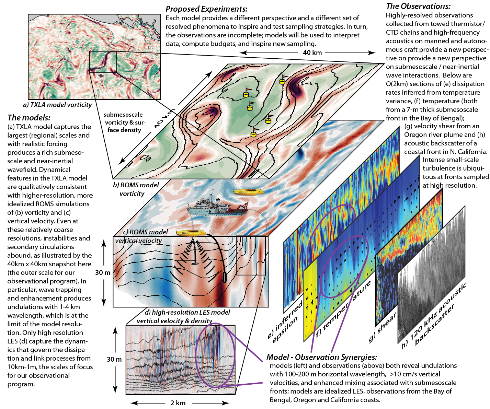

Project overview
======

Near-inertial motions (oscillations near the Coriolis frequency) and submesoscales (1-10km) are ubiquitous and important features of the upper ocean. Recent work has shown that near-inertial motions (NIOs) can directly interact with submesoscales and upper ocean turbulence, but these interactions are poorly understood. This project seeks to create a unified dynamical description of near-inertial and submesoscale motions and their influence on turbulent mixing. 

Location
=====

The northern Gulf of Mexico is an ideal place to observe the interaction between NIOs, submesoscales, and turbulence. Here (and near other freshwater sources), large lateral density gradients provide a persistent source of energy for submesoscale motions while providing the capacity for changes in vertical stratification through vertically-sheared currents. During summer in the northern Gulf of Mexico, storms are infrequent and winds are generally mild with a notable land-sea breeze that is nearly resonant with the local inertial period. Because of this, near-inertial currents are quite strong on the shelf, with observed amplitudes over 0.5 m s-1. Thus, the Mississippi/Atchafalaya river plume is an ideal location to study the interaction between near-inertial motions and submesoscale features in a new regime with stronger stratification and more energetic near-inertial motions than typical for the surface ocean mixed layer. Strong eddy activity is clearly seen in numerical simulations of shelf circulation:

Observational plan
======

