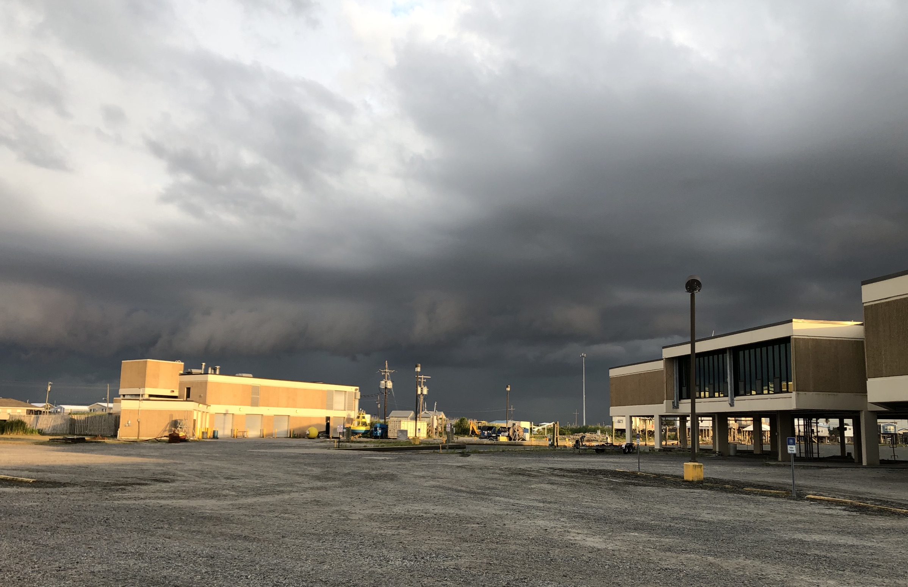
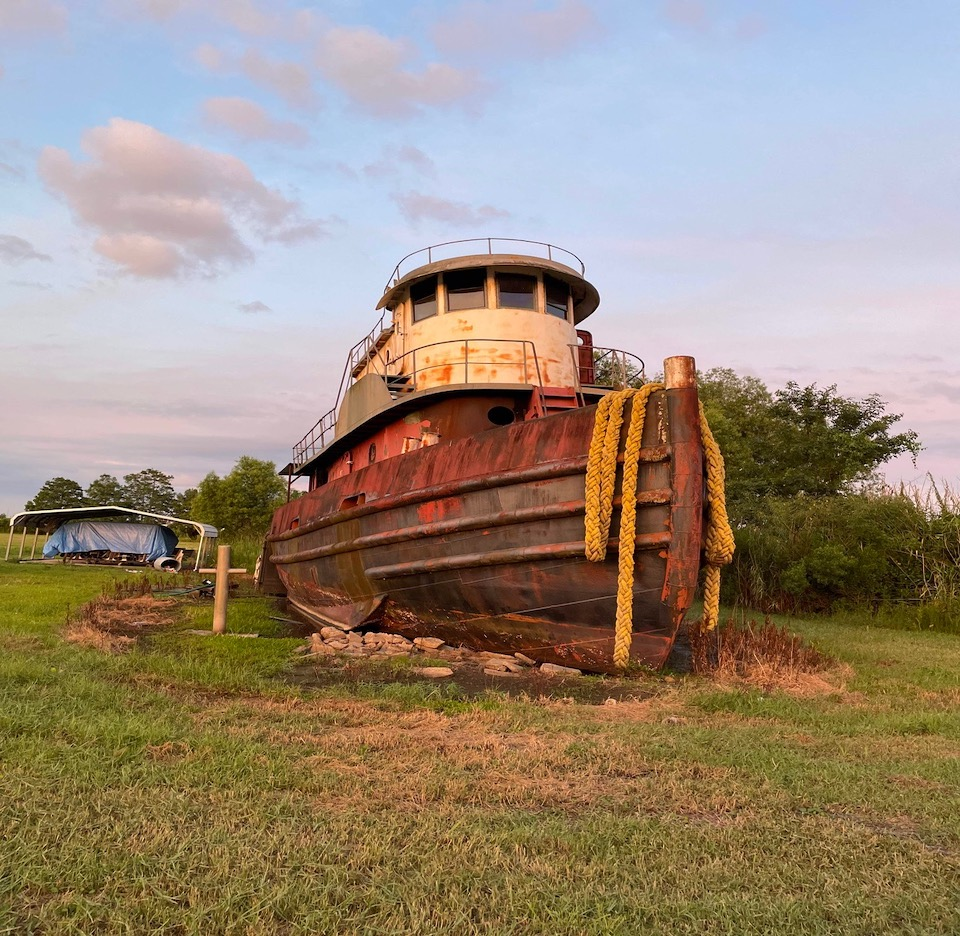
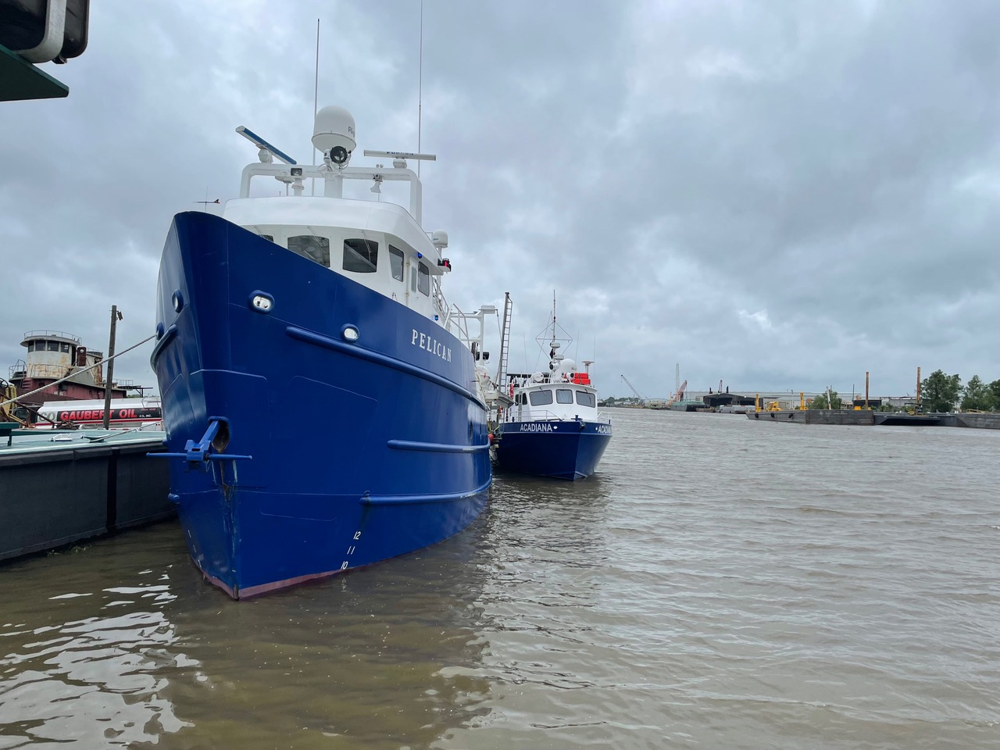
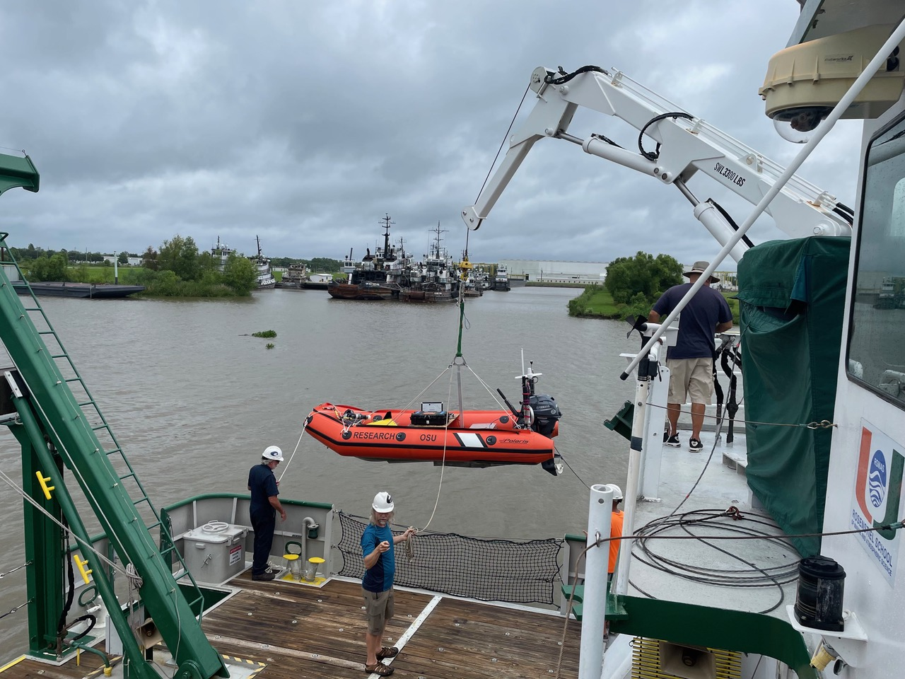

      
 Stormy weather: June 20-21, 2021   
      The SUNRISE Cruise began with some bad weather and a lot of seasickness. It didn’t
      sound too bad in the forecasts - 30 knot winds with 5 foot waves at a period of 5
      seconds - but for relatively small boats like the RV Pelican and RV Walton Smith, we
      really felt it. Almost everybody was seasick to some extent, but people powered through
      and we started sampling. <u> Read More! </u> 
  

      First with just the ship’s flow through system and ADCPs, then
      we added the CT chains, and finally started VMPing. By that team, we were gradually
      feeling better and better - getting our ‘sea legs.’  

        I’m always impressed by my friends and colleagues on the ship - such difficult
      conditions to work in and so much effort put into getting the work done. I am fortunate
      and grateful to be surrounded by such amazing people.  

         Leaving the channel with rough weather in the distance … the direction we’re
      heading 
        

         Screen shot of a video I took on Jun 21 - that is head-high water coming over
      the port rail. We were sampling with just the ADCPs and flow through at that point. 
        

         Fucent and Emily getting work done in rough conditions, and still smiling! 
        

         Jonny and Bofu getting ready to deploy the CT chain on the RV Pelican. The
      weather was still bad, but had let up enough to move on to finally putting some
      instruments in the water. 
        

         Towards the end, the storm would give up with out throwing a few water
      spouts at us … I’ve never seen a water spout in person before. It was a pretty ominous
      sight. There was also a lot of thunder and lightning during this period.
        

        -Kipp Shearman

     
   Chilling with Claudette: June 18, 2021   
      The SUNRISE science team  arrived at the LUMCON facility hoping for an efficient load-out. We are sailing on two ships, the R/V Pelican operated by LUMCON and the R/V Walton Smith operated by  RSMAS.   The plan was for the Walton Smith to load and depart first and do some scouting near our planned operational area, and then the Pelican would come out and join. However, as with many best laid fieldwork plans, Nature had other ideas.  <u> Read More! </u> 
  

      Tropical Depression Claudette arrived on the scene (first photo below). In anticipation of the storm surge and associated flooding, both ships were moved 25 miles inland through a really interesting series of inland canals and waterways, to Houma LA.   We managed to mobilize all our gear and people there, and appreciated the can-do attitude of both the LUMCON staff and the crews of both ships to get things done.  After installing and testing some of our equipment, we finally set sail Sunday morning.  Seas are a little big out here following the storm, but hopefully are calming down soon. Stay tuned for more about the different instruments we are using, the respective ships, the science questions we are excited to explore and hopefully some data!  

        Tropical Depression Claudette approaching LUMCON 
       

        Arriving at the site in Houma…."wait is that our ship??!" 
       

       R/V Walton Smith - she’s a catamaran! 
      

       Testing ROSS  - the OSU autonomous boat 
      

       Our beloved bow commander, to  be used to  deploy and recover a towed thermistor chain 
      

       Mounting instruments onto a pole 
      

       And we’re off!  The scenery in these wetlands was really quite lovely. If you zoom in  you can see the Walton Smith following 
      

      -Jennifer MacKinnon

