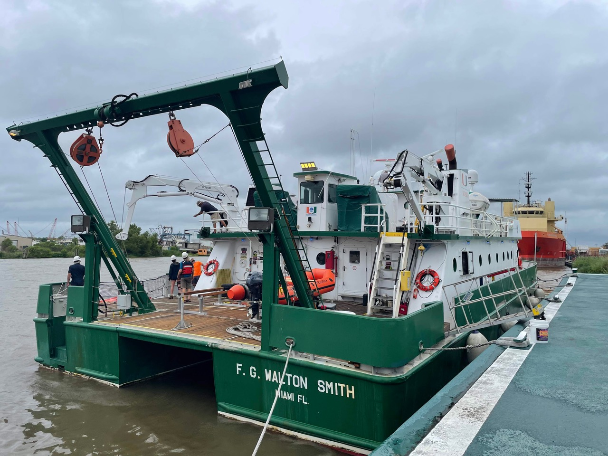

The SUNRISE science team  arrived at the LUMCON facility hoping for an efficient load-out. We are sailing on two ships, the R/V Pelican operated by LUMCON and the R/V Walton Smith operated by  RSMAS.   The plan was for the Walton Smith to load and depart first and do some scouting near our planned operational area, and then the Pelican would come out and join.   However, as with many best laid fieldwork plans, Nature had other ideas.  Tropical Depression Claudette arrived on the scene (first photo below). In anticipation of the storm surge and associated flooding, both ships were moved 25 miles inland through a really interesting series of inland canals and waterways, to Houma LA.   We managed to mobilize all our gear and people there, and appreciated the can-do attitude of both the LUMCON staff and the crews of both ships to get things done.  After installing and testing some of our equipment, we finally set sail Sunday morning.  Seas are a little big out here following the storm, but hopefully are calming down soon. Stay tuned for more about the different instruments we are using, the respective ships, the science questions we are excited to explore and hopefully some data!

Tropical Depression Claudette approaching LUMCON

Arriving at the site in Houma…."wait is that our ship??!"

The R/V Pelican and friend  - the R/V Acadiana was just back from other recent fieldwork conducted by some of our colleagues

R/V Walton Smith - she’s a catamaran!

Testing ROSS  - the OSU autonomous boat

Our beloved bow commander, to  be used to  deploy and recover a towed thermistor chain

Mounting instruments onto a pole

 And we’re off!  The scenery in these wetlands was really quite lovely. If you zoom in  you can see the Walton Smith following
